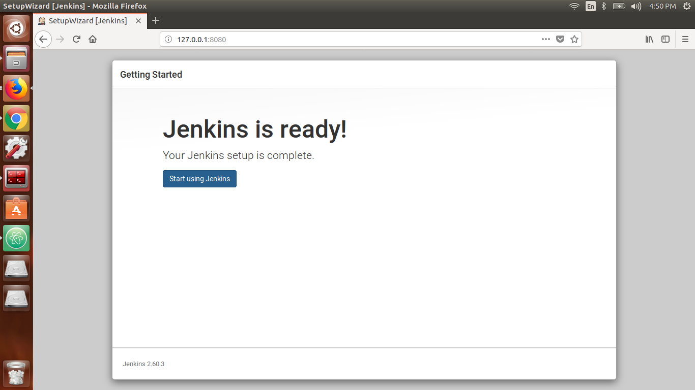
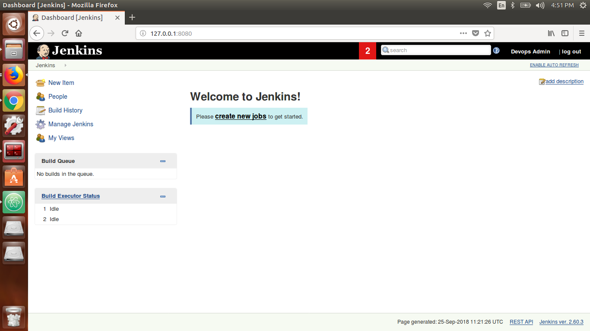

# Just enough Jenkins for a DevOps Engineer

### **Jenkins**
Jenkins is a essential automation tool to setup Continuous Integration. Its the integrator which helps you build your development, testing and deployment workflow and create job pipelines. It also adds visibility to all stake holders including the Dev, QA, Ops teams involved in building, testing and deploying the product.  

### Launching Jenkins Server using Docker

Proceed with installing Docker Engine on your choice of Operating System. For details on how to install docker visit the official installation page at <a href="https://docs.docker.com/install/">docs.docker.com.</a>

We assume you have installed docker and are ready to launch containers before proceeding. To validate docker environment run.

```
 sudo docker version
 docker ps
```
If the above command goes through without errors, you are all set.

After installing docker, pull our Jenkins docker image from <a href="https://hub.docker.com/_/jenkins/">docker hub.

This is the simplest way of installing Jenkins and requires minimal efforts.
```
docker run -idt --name jenkins -v /var/run/docker.sock:/var/run/docker.sock -p 8080:8080 -p 50000:50000 schoolofdevops/jenkins
```

after this check the container and visit your site on **localhost:8080** or **youripaddress:8080** port.


We need Administrator password for unlock the Jenkins.for getting password we have to run following command in our terminal.
```
docker logs jenkins
```
We will get similar output as given below.

```
$ docker logs jenkins
Running from: /usr/share/jenkins/jenkins.war
webroot: EnvVars.masterEnvVars.get("JENKINS_HOME")
Sep 25, 2018 9:52:53 AM Main deleteWinstoneTempContents
WARNING: Failed to delete the temporary Winstone file /tmp/winstone/jenkins.war
Sep 25, 2018 9:52:53 AM org.eclipse.jetty.util.log.JavaUtilLog info
INFO: Logging initialized @3807ms
Sep 25, 2018 9:52:53 AM winstone.Logger logInternal
INFO: Beginning extraction from war file
Sep 25, 2018 9:52:58 AM org.eclipse.jetty.util.log.JavaUtilLog warn
WARNING: Empty contextPath
Sep 25, 2018 9:52:59 AM org.eclipse.jetty.util.log.JavaUtilLog info
INFO: jetty-9.2.z-SNAPSHOT
Sep 25, 2018 9:53:00 AM org.eclipse.jetty.util.log.JavaUtilLog info
INFO: NO JSP Support for /, did not find org.eclipse.jetty.jsp.JettyJspServlet
Jenkins home directory: /var/jenkins_home found at: EnvVars.masterEnvVars.get("JENKINS_HOME")
Sep 25, 2018 9:53:03 AM org.eclipse.jetty.util.log.JavaUtilLog info
INFO: Started w.@47404bea{/,file:/var/jenkins_home/war/,AVAILABLE}{/var/jenkins_home/war}
Sep 25, 2018 9:53:04 AM org.eclipse.jetty.util.log.JavaUtilLog info
INFO: Started ServerConnector@458342d3{HTTP/1.1}{0.0.0.0:8080}
Sep 25, 2018 9:53:04 AM org.eclipse.jetty.util.log.JavaUtilLog info
INFO: Started @14194ms
INFO: Bean factory for application context [org.springframework.web.context.support.StaticWebApplicationContext@3567d41e]: org.springframework.beans.factory.support.DefaultListableBeanFactory@3526e0c4
Sep 25, 2018 9:53:27 AM org.springframework.beans.factory.support.DefaultListableBeanFactory preInstantiateSingletons
INFO: Pre-instantiating singletons in org.springframework.beans.factory.support.DefaultListableBeanFactory@3526e0c4: defining beans [authenticationManager]; root of factory hierarchy
Sep 25, 2018 9:53:29 AM org.springframework.context.support.AbstractApplicationContext prepareRefresh
INFO: Refreshing org.springframework.web.context.support.StaticWebApplicationContext@631dccbe: display name [Root WebApplicationContext]; startup date [Tue Sep 25 09:53:29 UTC 2018]; root of context hierarchy
Sep 25, 2018 9:53:29 AM org.springframework.context.support.AbstractApplicationContext obtainFreshBeanFactory
INFO: Bean factory for application context [org.springframework.web.context.support.StaticWebApplicationContext@631dccbe]: org.springframework.beans.factory.support.DefaultListableBeanFactory@796df9e7
Sep 25, 2018 9:53:29 AM org.springframework.beans.factory.support.DefaultListableBeanFactory preInstantiateSingletons
INFO: Pre-instantiating singletons in org.springframework.beans.factory.support.DefaultListableBeanFactory@796df9e7: defining beans [filter,legacy]; root of factory hierarchy
Sep 25, 2018 9:53:31 AM jenkins.install.SetupWizard init
INFO:

*************************************************************
*************************************************************
*************************************************************

Jenkins initial setup is required. An admin user has been created and a password generated.
Please use the following password to proceed to installation:

4f68f8ba3144466f8c4677fa24e16bab

This may also be found at: /var/jenkins_home/secrets/initialAdminPassword

*************************************************************
*************************************************************
*************************************************************

Sep 25, 2018 9:53:33 AM hudson.model.UpdateSite updateData
INFO: Obtained the latest update center data file for UpdateSource default
--> setting agent port for jnlp
--> setting agent port for jnlp... done
Sep 25, 2018 9:53:33 AM hudson.model.DownloadService$Downloadable load
INFO: Obtained the updated data file for hudson.tasks.Maven.MavenInstaller
Sep 25, 2018 9:53:37 AM hudson.model.DownloadService$Downloadable load
INFO: Obtained the updated data file for hudson.tools.JDKInstaller
Sep 25, 2018 9:53:37 AM hudson.model.AsyncPeriodicWork$1 run
INFO: Finished Download metadata. 16,625 ms
Sep 25, 2018 9:53:41 AM hudson.model.UpdateSite updateData
INFO: Obtained the latest update center data file for UpdateSource default
Sep 25, 2018 9:53:41 AM hudson.WebAppMain$3 run
INFO: Jenkins is fully up and running
Running from: /usr/share/jenkins/jenkins.war
webroot: EnvVars.masterEnvVars.get("JENKINS_HOME")
Sep 25, 2018 10:34:15 AM Main deleteWinstoneTempContents
WARNING: Failed to delete the temporary Winstone file /tmp/winstone/jenkins.war
Sep 25, 2018 10:34:15 AM org.eclipse.jetty.util.log.JavaUtilLog info
INFO: Logging initialized @2890ms
Sep 25, 2018 10:34:15 AM winstone.Logger logInternal
INFO: Beginning extraction from war file
Sep 25, 2018 10:34:15 AM org.eclipse.jetty.util.log.JavaUtilLog warn
WARNING: Empty contextPath
Sep 25, 2018 10:34:16 AM org.eclipse.jetty.util.log.JavaUtilLog info
INFO: jetty-9.2.z-SNAPSHOT
Sep 25, 2018 10:34:19 AM org.eclipse.jetty.util.log.JavaUtilLog info
INFO: NO JSP Support for /, did not find org.eclipse.jetty.jsp.JettyJspServlet
Jenkins home directory: /var/jenkins_home found at: EnvVars.masterEnvVars.get("JENKINS_HOME")
Sep 25, 2018 10:34:22 AM org.eclipse.jetty.util.log.JavaUtilLog info
INFO: Started w.@470734c3{/,file:/var/jenkins_home/war/,AVAILABLE}{/var/jenkins_home/war}
Sep 25, 2018 10:34:22 AM org.eclipse.jetty.util.log.JavaUtilLog info
INFO: Started ServerConnector@4be29ed9{HTTP/1.1}{0.0.0.0:8080}
Sep 25, 2018 10:34:22 AM org.eclipse.jetty.util.log.JavaUtilLog info
INFO: Started @9703ms
INFO: Refreshing org.springframework.web.context.support.StaticWebApplicationContext@262149b1: display name [Root WebApplicationContext]; startup date [Tue Sep 25 10:34:33 UTC 2018]; root of context hierarchy
Sep 25, 2018 10:34:33 AM org.springframework.context.support.AbstractApplicationContext obtainFreshBeanFactory
INFO: Bean factory for application context [org.springframework.web.context.support.StaticWebApplicationContext@262149b1]: org.springframework.beans.factory.support.DefaultListableBeanFactory@6d0c403f
Sep 25, 2018 10:34:33 AM org.springframework.beans.factory.support.DefaultListableBeanFactory preInstantiateSingletons
INFO: Pre-instantiating singletons in org.springframework.beans.factory.support.DefaultListableBeanFactory@6d0c403f: defining beans [authenticationManager]; root of factory hierarchy
Sep 25, 2018 10:34:33 AM org.springframework.context.support.AbstractApplicationContext prepareRefresh
INFO: Refreshing org.springframework.web.context.support.StaticWebApplicationContext@28652711: display name [Root WebApplicationContext]; startup date [Tue Sep 25 10:34:33 UTC 2018]; root of context hierarchy
Sep 25, 2018 10:34:33 AM org.springframework.context.support.AbstractApplicationContext obtainFreshBeanFactory
INFO: Bean factory for application context [org.springframework.web.context.support.StaticWebApplicationContext@28652711]: org.springframework.beans.factory.support.DefaultListableBeanFactory@6235b12a
Sep 25, 2018 10:34:33 AM org.springframework.beans.factory.support.DefaultListableBeanFactory preInstantiateSingletons
INFO: Pre-instantiating singletons in org.springframework.beans.factory.support.DefaultListableBeanFactory@6235b12a: defining beans [filter,legacy]; root of factory hierarchy
Sep 25, 2018 10:34:34 AM jenkins.install.SetupWizard init
INFO:

*************************************************************
*************************************************************
*************************************************************

Jenkins initial setup is required. An admin user has been created and a password generated.
Please use the following password to proceed to installation:

4f68f8ba3144466f8c4677fa24e16bab

This may also be found at: /var/jenkins_home/secrets/initialAdminPassword

*************************************************************
*************************************************************
*************************************************************

--> setting agent port for jnlp
--> setting agent port for jnlp... done
Sep 25, 2018 10:34:44 AM hudson.model.UpdateSite updateData
INFO: Obtained the latest update center data file for UpdateSource default
Sep 25, 2018 10:34:44 AM hudson.WebAppMain$3 run
INFO: Jenkins is fully up and running

```

Run the below commad to get our Administrator password from jenkins logs.
```
docker exec jenkins cat /var/jenkins_home/secrets/initialAdminPassword
```

We will get similar output as given below.
```
$ docker exec jenkins cat /var/jenkins_home/secrets/initialAdminPassword
4f68f8ba3144466f8c4677fa24e16bab

```
Add the Administrator password, we will get configurations page for Jenkins.There will be two options, choose anyone from that options.


Here we are selecting, select plugins to install. it will give more plugins whatever we want to install.


Next, select None, to add plugins later and install Jenkins.


Use credentials to create your user.


Finalized your setup will be look like This,





